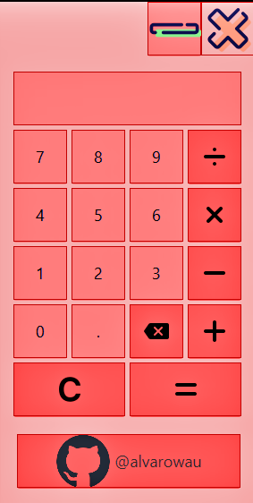
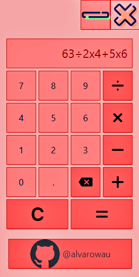
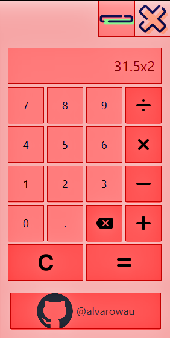
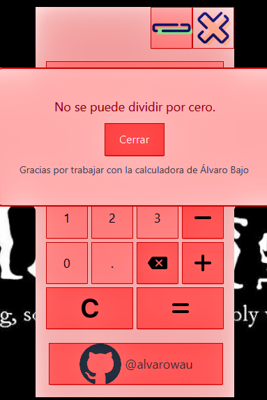

<!DOCTYPE html>
<html lang="es">
<head>
  <meta charset="UTF-8">
  <meta name="viewport" content="width=device-width, initial-scale=1.0">
  <title>Calculadora de Álvaro Bajo</title>
  <link rel="stylesheet" href="css/styles.css">
</head>
<body>

  <h1>Calculadora de Álvaro Bajo</h1>

  <h2>Cosas necesarias para usar el proyecto</h2>

  
Este proyecto utiliza JavaFX para su interfaz de usuario. A continuación, se detallan los pasos necesarios para configurar y ejecutar la aplicación:

  <ol>
    <li><strong>Java Development Kit (JDK):</strong> Asegúrate de tener instalado JDK en tu sistema. Puedes descargarlo desde el sitio web oficial de Oracle o utilizar una distribución OpenJDK.</li>
    <li><strong>JavaFX:</strong> JavaFX es una biblioteca de software para la creación y despliegue de aplicaciones de escritorio enriquecidas en Java. Puedes obtener JavaFX como parte de OpenJFX o como parte del JDK de Oracle hasta la versión 10. A partir de JDK 11, JavaFX se separó del JDK principal y debes agregarlo como una dependencia. Puedes obtener más información sobre cómo hacerlo en la <a href="https://openjfx.io/">documentación oficial de OpenJFX</a>.</li>
    <li><strong>Configuración del entorno de desarrollo:</strong> Configura tu entorno de desarrollo integrado (IDE) para que reconozca JavaFX y pueda compilar y ejecutar la aplicación. Consulta la documentación de tu IDE para obtener instrucciones específicas sobre cómo configurar JavaFX.</li>
  </ol>

  <h2>Características</h2>

  <ul>
    <li>Interfaz de usuario intuitiva</li>
    <li>Operaciones básicas: suma, resta, multiplicación y división</li>
    <li>Manejo de errores con mensajes claros</li>
  </ul>

  <h2>Capturas de pantalla</h2>

<!-- Captura de pantalla 1 -->
<figure>
    
    <figcaption>Interfaz de la aplicación</figcaption>
</figure>

<!-- Captura de pantalla 2 -->
<figure>
    
    <figcaption>Se pueden hacer varias operaciones seguidas</figcaption>
</figure>

<!-- Captura de pantalla 3 -->
<figure>
    
    <figcaption>Se puede trabajar con decimales</figcaption>
</figure>

<!-- Captura de pantalla 4 -->
<figure>
    
    <figcaption>Ventana de errores</figcaption>
</figure>

  <h2>Instalación</h2>

  
Para ejecutar la aplicación localmente, sigue estos pasos:

  <ol>
    <li>Clona este repositorio en tu máquina local.</li>
    <li>Abre el proyecto en tu IDE preferido.</li>
    <li>Ejecuta la aplicación desde tu IDE o construye un archivo JAR ejecutable.</li>
  </ol>

  <h2>Uso</h2>

  <ul>
    <li>Abre la aplicación.</li>
    <li>Ingresa los números y realiza operaciones haciendo clic en los botones correspondientes.</li>
    <li>Si ocurre un error, se mostrará una ventana de error con un mensaje descriptivo.</li>
  </ul>

  <h2>Contribución</h2>

  
Si quieres contribuir a este proyecto, sigue estos pasos:

  <ol>
    <li>Haz un fork del repositorio.</li>
    <li>Crea una nueva rama (<code>git checkout -b feature/nueva-caracteristica</code>).</li>
    <li>Realiza tus cambios y haz commit (<code>git commit -am 'Añade nueva característica'</code>).</li>
    <li>Haz push a la rama (<code>git push origin feature/nueva-caracteristica</code>).</li>
    <li>Abre un pull request.</li>
  </ol>

  <h2>Autor</h2>

  <ul>
    <li>Álvaro Bajo - <a href="https://github.com/alvarowau">@alvarowau</a></li>
  </ul>

  <h2>Licencia</h2>

  
Este proyecto está licenciado bajo la Licencia MIT. Consulta el archivo <a href="LICENSE">LICENSE</a> para obtener más detalles.

</body>
</html>
